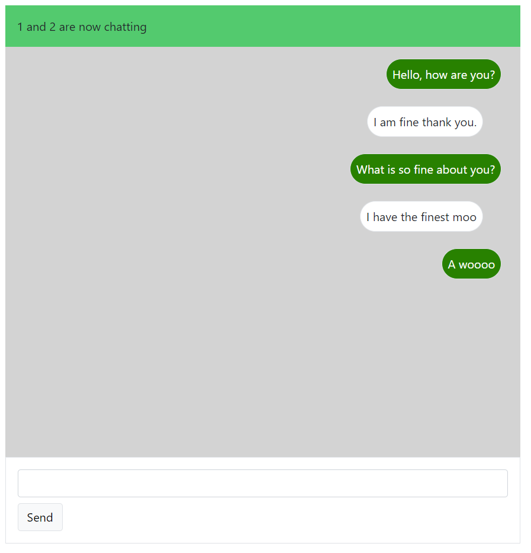
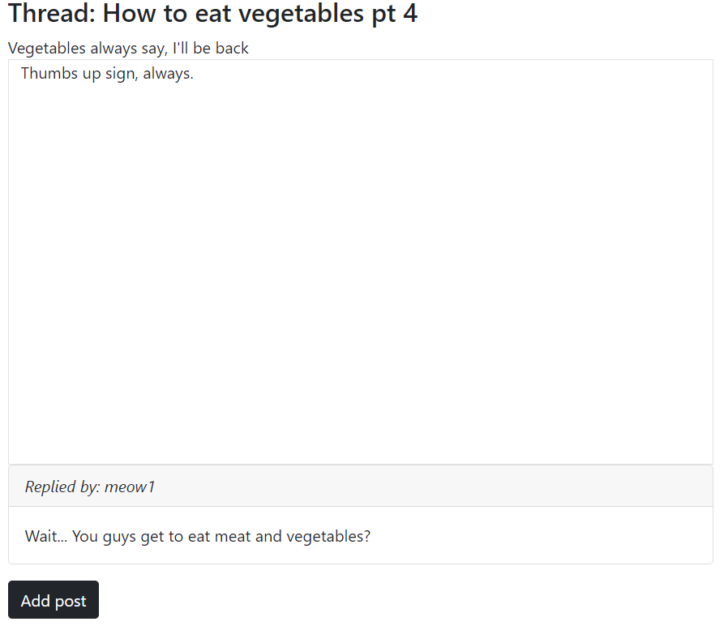
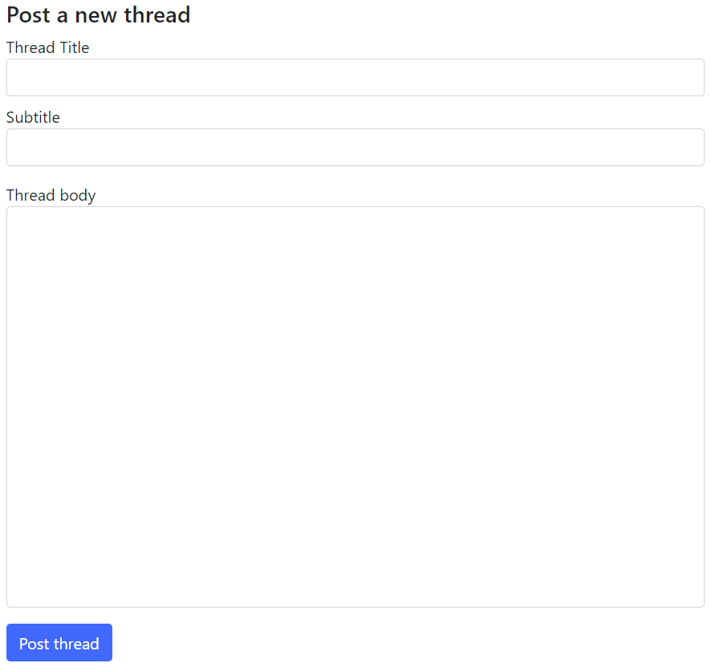
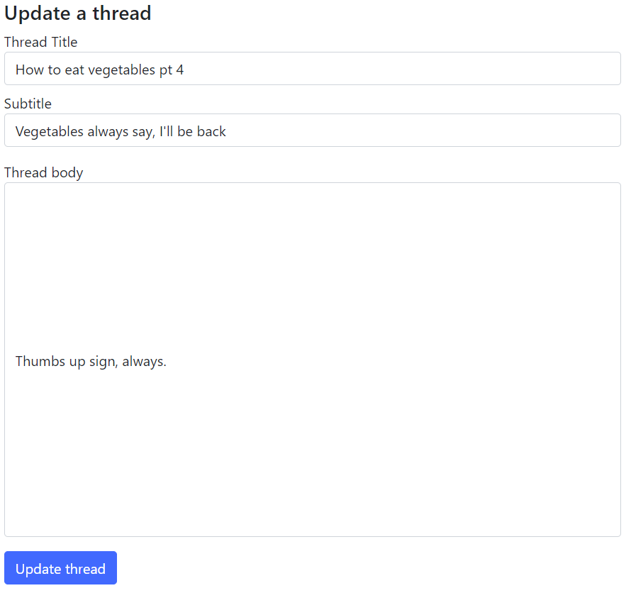

<h4> DEMO FOR Using SQL Queries, Manipulation <h4>

<h5> Very Simple Chat room page </h5>

Explanation: Different users' can chat in this room and chat messages will be visually differentiated by users.
Technical Implementation: users will add to the chatroom pivot table for Many to Many relation in SQL.

<h5> Very Simple Forum Page </h5>

Explanation: Different users can interact in the forum through posts. Users are identifiable by their user names when they post. (In future when user login is implemented, user interface will include the add post function, where users can easily add a comment to a Thread.)

For now, add and update will be through params.id and params.threadId to triangulate the correct post and user permissions that will work well with JWT on future implementation.

Thanks for viewing this demo.